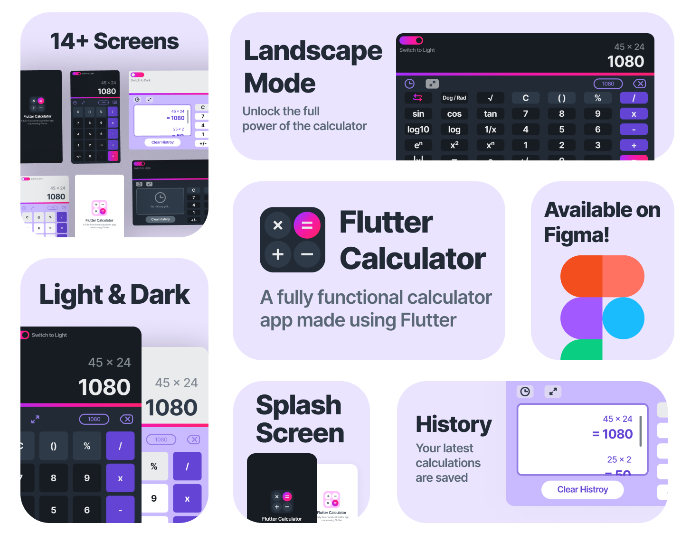
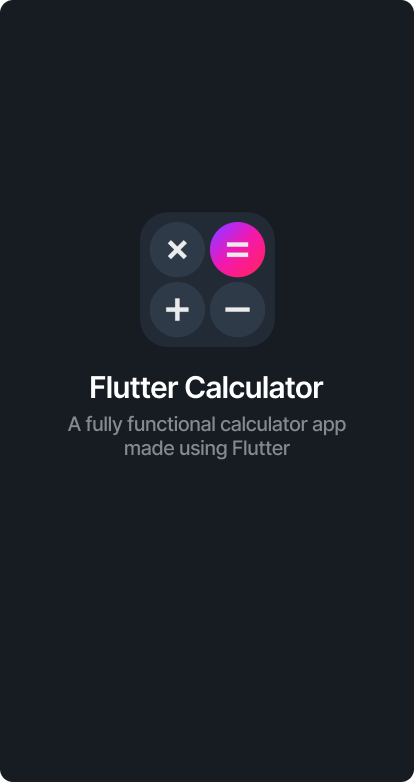
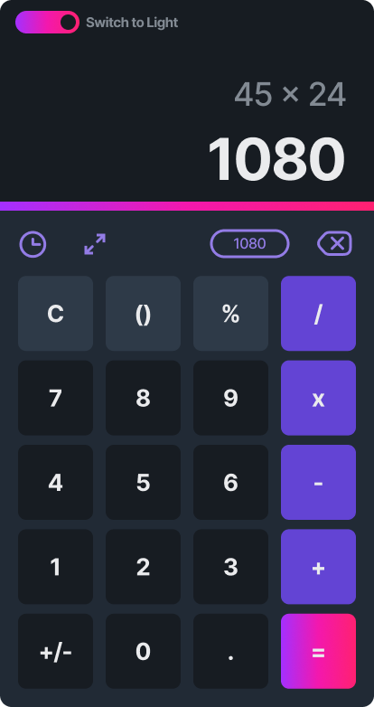
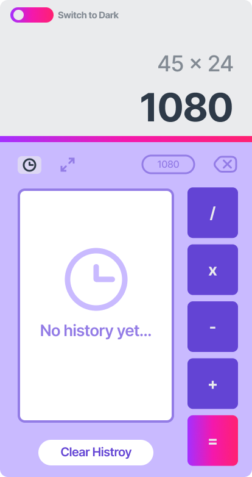

# 🔢 Flutter Calculator
A fully functional calculator app made using Flutter

# 📷 screenshots

|       | Splash                                 | Home                               | Landscape                             |
|-------|----------------------------------------|------------------------------------|---------------------------------------|
| Dark  |  |  |  |
| Light |       |       |       |

# 🎨 Figma Project

There is also a free Figma project for this app.

You can check it out from here: https://www.figma.com/community/file/1139564128546110522

# 🔨 Used packages

- [provider](https://pub.dev/packages/provider): for state management.
- [eval_ex](https://pub.dev/packages/eval_ex): for mathematical equation evaluation.
- [flutter_svg](https://pub.dev/packages/flutter_svg): for SVG icons.
- [shared_preferences](https://pub.dev/packages/shared_preferences): to save history and theme mode loacaly.

# 📂 Download the app and test it

- ### [📱 Android](https://github.com/aymendn/Flutter-Calculator/releases/download/v1.0.0/Flutter-Calculator.apk)

- ### [💻 Windows](https://github.com/aymendn/Flutter-Calculator/releases/download/v1.0.0/Windows-Release.rar)

# 🤝 Contribution

This project is open for any kind of contribution.

If you have noticed any bad practices or using things in the wrong way, please notify me via my email: [aymendnb@gmail.com](mailto:aymendnb@gmail.com?subject=Flutter%20calculator%20app)
